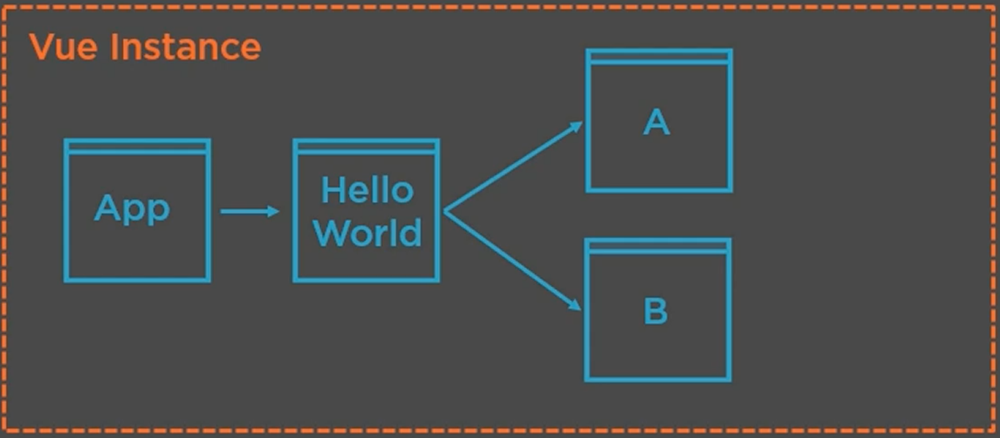
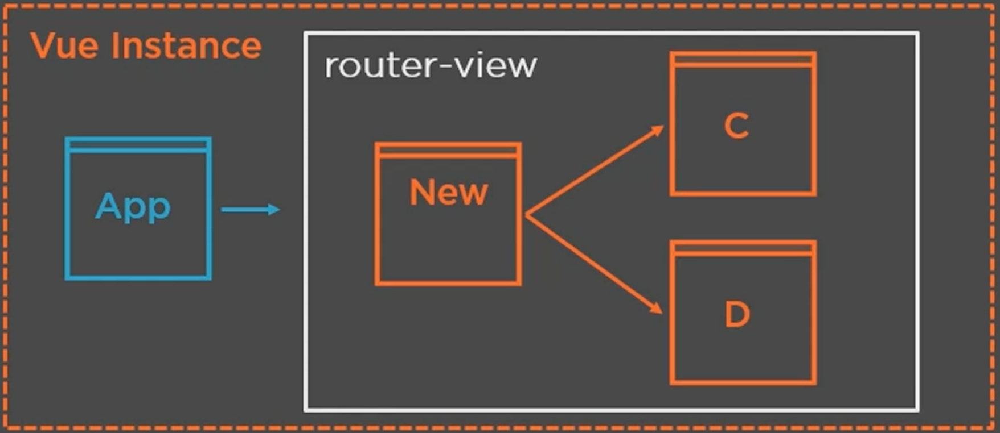

# Vue Code Excercise
Vue basics to understand how to build and refactor local vue. Recently solving a latest [Webpack](https://webpack.js.org/) upgrade with a current project I am working on, and so need familiarisation with the vue framework, so I thought I woul start with gettign used to what it is. I have experienced very positive feedback from friends who worked with this JS framework, just never seemed to be as popular as React or Angular, so I never bothered to get auqanted with yet-another-js-framework but I always been curious about this one. So now I got a reason ...

## Gettign started

- The ***Vue*** instance is the heart of the app with an Application vue template

  ```javascript
  import * as Vue from 'vue'
  import App from './App.vue'
  
  Vue.createApp(App)
  ```

- Instances and components are very similare to REACT and other JS frameworks

  

- **Routing** is also built in as a primary concept within *router-view*

  

- Setup the CLI as the vue team by installing this globally `npm i -g @vue/cli` 

- Once the CLI is setup you can generate a new project `vue create <Your-spa-app>`

## References

- [Pluralsight course](https://app.pluralsight.com/library/courses/vuejs-fundamentals/table-of-contents?aid=701j0000001heIpAAI) on vue as inspriation for basics
